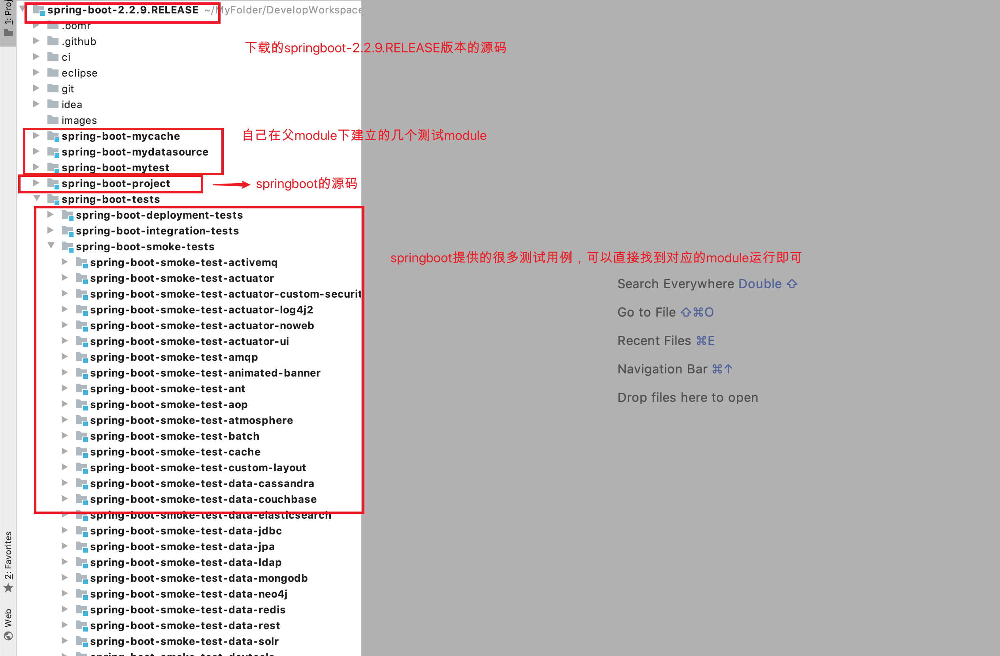

## 工程说明

### 1、工程的用途

- 该工程为学习springboot源码而搭建的调试工程，基于springboot-2.2.9.RELEASE 版本
- 工程用于添加学习springboot的注释
- 在父工程下自己新建了多个module，这些module都以xxx-myxxx形式命名

### 2、工程结构

- 该工程源码基于springboot.2.2.9.RELEASE版本
- 对源码做了微调，方便一键启动测试

